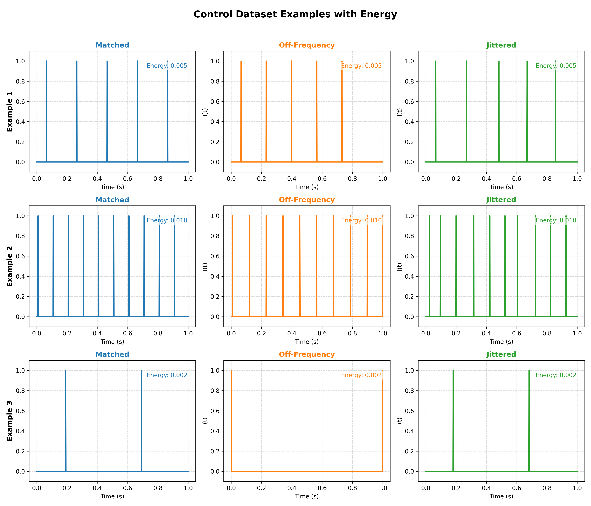

# Fundamental Research in Machine and Deep Learning: Assignment 2 (Control Dataset)

To create the dataset simply run `generate_dataset.py` file. It will save the data into a npy file in a data folder.

To visualize use `visualize.py` file. To keep things interesting, added some randomization in there maybe each time you generate you will visualize different samples.

An example can be seen below:

